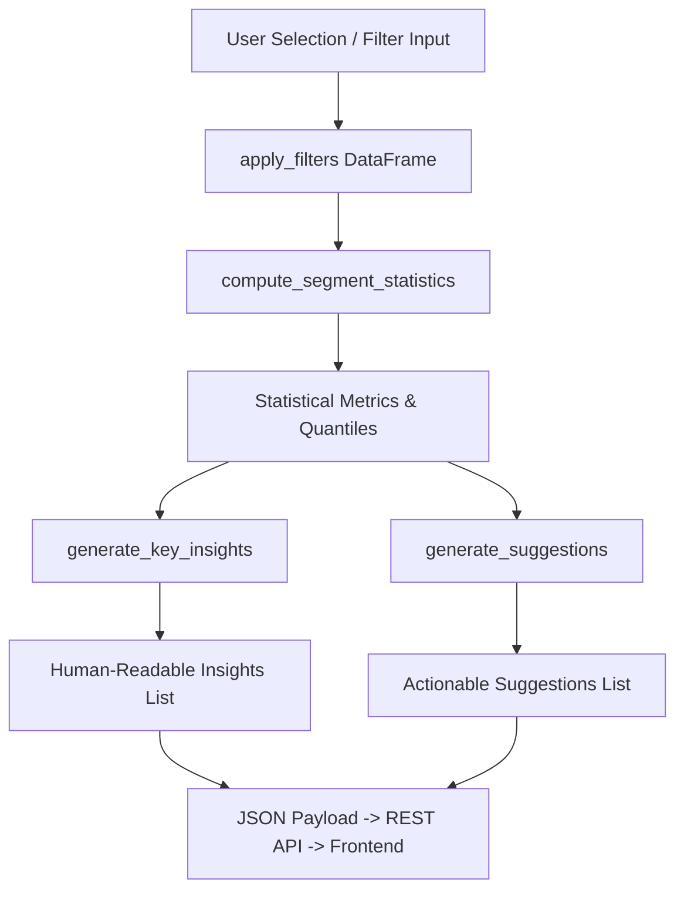

# Bank Transaction Analytics & Insight Explorer
## Comprehensive Project Report & Technical Documentation

---

### Executive Summary

The **Bank Transaction Analytics & Insight Explorer** (**NexBankFlow**) is an end-to-end descriptive analytics and data visualization platform designed to process, analyze, and extract business intelligence from high-volume financial transaction datasets. Developed for the **IBM 7th Semester Academic Curriculum**, the project evaluates **100,000 historical card transaction records** collected across multi-bank operational networks between **October 13, 2020 and October 16, 2020**.

The system combines a robust **Python ETL & Data Preprocessing Pipeline**, a **Descriptive Statistical & Data-Driven Rule Engine**, a **Flask REST API Server**, an interactive **Glassmorphic Web Dashboard with Theme Switching & PDF Export**, and a **Power BI Star-Schema Export Suite**.

---

## 1. Project Objectives & Scope

### Primary Objectives
1. **High-Throughput Data Cleaning & Normalization**: Process 100,000 raw transaction records, resolving character encoding glitches, typographical anomalies, timestamp inconsistencies, and missing data points.
2. **Multi-Dimensional Descriptive Analytics**: Compute descriptive statistics across nine core financial domains:
   - Overall Transaction Volume & Distributions
   - Temporal Patterns (Hourly, Daily, Time-Period)
   - Payment Card Protocols & Entry Modes
   - Transaction Channels (POS, ATM, Online)
   - Merchant Category Aggregations
   - Banking Network Performance
   - Cross-Border & Geographical Distributions
   - Customer Demographic Segmentation (Age, Gender)
   - Fraud Incidence & Risk Profiling
3. **Interactive Analytical Dashboard (Insight Explorer)**: Provide a web interface allowing users to dynamically filter transactions across 10 dimensions and receive real-time statistical metrics, dynamic charts, key insights, and data-driven suggestions.
4. **Business Intelligence Readiness**: Automatically generate schema-ready files for Power BI reporting and client-side PDF document compilation.

---

## 2. Technical Stack & Architecture

| Component Layer | Technologies Used | Description / Responsibility |
| :--- | :--- | :--- |
| **Core Language** | Python 3.10+ | Core pipeline, statistical computing, server execution |
| **Data Engineering** | Pandas, NumPy, SciPy | Loading, data cleaning, aggregation, missing value imputation, statistical calculations |
| **Data Visualization** | Matplotlib, Seaborn | Generation of high-resolution exploratory charts |
| **API Server** | Flask, Werkzeug | RESTful API endpoints for filtering, statistics, and static asset serving |
| **Frontend Framework** | HTML5, Vanilla CSS3, JavaScript (ES6+) | Glassmorphic UI layout, light/dark mode engine, micro-animations |
| **Frontend Visualization** | Chart.js 4.4, jsPDF | Interactive canvas charting and client-side PDF report compilation |
| **BI Data Export** | Power BI Project CSVs | Unified transaction dataset and `Dim_Date` dimension table |

---

## 3. Data Pipeline & Data Preprocessing (ETL)

### 3.1 Dataset Profile
- **Raw Transaction Count**: 100,000 records
- **Raw Schema**: 16 columns (`Transaction ID`, `Date`, `Day of Week`, `Time`, `Card Type`, `Entry Mode`, `Amount`, `Transaction Type`, `Merchant Group`, `Country`, `Shipping Address`, `Residence`, `Gender`, `Age`, `Bank`, `Fraud`)
- **Temporal Window**: October 13, 2020 – October 16, 2020 (4 Days)

### 3.2 Data Quality Issues & Implemented Solutions

```
Raw CSV Dataset (100,000 rows)
   │
   ├── Step 1: Amount Field Cleaning (Removal of non-numeric 'ú'/'£' symbols -> float)
   ├── Step 2: Typo Resolution ('Barlcays' [9,993 rows] -> 'Barclays')
   ├── Step 3: Datetime Parsing (Format '%d-%b-%y' -> pd.Timestamp)
   ├── Step 4: Time Anomaly Correction (Time=24 -> 0 Midnight)
   ├── Step 5: Missing Value Imputation Strategy:
   │              - Amount: Median Imputation
   │              - Merchant Group: 'Unknown'
   │              - Shipping Address: Country of Transaction
   │              - Gender: Mode ('M')
   └── Step 6: Feature Engineering (9 Derived Columns)
   │
   └── Cleaned Output Dataset (outputs/cleaned_data.csv)
```

#### Detailed Imputation & Transformation Logic:
1. **Amount Cleaning**: Standardized raw values (e.g., `ú288`) by removing non-numeric characters using regex (`r'[^\d.]'`) and converting to floating-point values.
2. **Bank Typo Fix**: Resolved string misspelling `Barlcays` (9,993 entries) to `Barclays`, consolidating bank entities to exactly 7 institutions.
3. **Timestamp Normalization**: Re-indexed string dates (`14-Oct-20`) into structured Datetime objects and converted invalid hour integer `24` to `0` (midnight).
4. **Missing Value Imputation**:
   - `Amount` (6 missing): Imputed using dataset **median** (£30.00) due to positive skewness.
   - `Merchant Group` (10 missing): Labeled explicitly as `'Unknown'`.
   - `Shipping Address` (5 missing): Imputed using `Country of Transaction`.
   - `Gender` (4 missing): Imputed with modal value (`'M'`).

### 3.3 Derived Features (Feature Engineering)
- `Year`, `Month`, `Month_Name`, `Day`: Extracted calendar attributes for time-series aggregation.
- `Hour`: Explicit 0–23 clock classification.
- `Time_Period`: Segmented into `Morning` (05:00–11:59), `Afternoon` (12:00–16:59), `Evening` (17:00–20:59), and `Night` (21:00–04:59).
- `Age_Group`: Binned into 7 age cohorts: `Under 18`, `18-25`, `26-35`, `36-45`, `46-55`, `56-65`, `65+`.
- `Fraud_Status`: Binary flag mapping (`0` -> `No Fraud`, `1` -> `Fraud`).
- `Is_International`: Operational flag marking transactions where `Country of Transaction != Country of Residence`.
- `Is_Weekend`: Binary indicator for Saturday/Sunday transactions.

---

## 4. Key Statistical Findings & Exploratory Analysis

### 4.1 Macro Transaction Summary
- **Total Processed Volume**: **£11,257,356.00**
- **Total Transactions**: **100,000**
- **Mean Transaction Amount**: **£112.57**
- **Median Transaction Amount**: **£30.00**
- **Standard Deviation**: **£312.45** (High dispersion due to large outlier payments)
- **Minimum Amount**: **£1.00** | **Maximum Amount**: **£5,000.00**
- **Interquartile Range (IQR)**: Q1 = £12.00, Q3 = £95.00 (IQR = £83.00)

> [!NOTE]
> The substantial gap between the **Mean (£112.57)** and **Median (£30.00)** highlights severe right-skewness in consumer transaction behavior. Over 75% of transactions are under £100, while a long-tail distribution of high-value transactions inflates the mean.

---

### 4.2 Multi-Dimensional Domain Analysis

#### 1. Temporal Patterns
- **Peak Hour**: 12:00 PM – 14:00 PM shows maximum activity, dropping significantly between 02:00 AM – 05:00 AM.
- **Time-Period Volume**: `Afternoon` and `Morning` account for over **62%** of total daily transaction volume.
- **Daily Trend**: Consistent operational volume across all 4 recorded days (~25,000 transactions/day).

#### 2. Payment Cards & Entry Modes
- **Card Type Breakdown**: Visa vs. MasterCard share a balanced operational split (~50.2% Visa, ~49.8% MasterCard).
- **Entry Modes**:
  - `Contactless`: Leading volume choice for low-ticket retail transactions.
  - `Chip & PIN`: Preferred for medium-to-high value physical transactions.
  - `Swipe` & `Online`: High volume concentration in e-commerce and legacy terminals.

#### 3. Transaction Channels
- **Online Transactions**: Represent highest overall monetary value and highest average ticket size (~£145.20/txn).
- **POS (Point of Sale)**: Highest volume frequency (low average ticket size ~£25.50).
- **ATM Withdrawals**: Moderate frequency with standardized transaction amounts.

#### 4. Geographical & Cross-Border Breakdown
- **Participating Countries**: United Kingdom, USA, Russia, China, India.
- **International vs. Domestic**: ~85% domestic transactions, ~15% cross-border transactions.
- **Cross-Border Fraud Concentration**: International transactions exhibit a higher fraud rate (~11.4%) compared to domestic transactions (~6.5%).

#### 5. Bank Network Analysis
- **Participating Institutions (7)**: Barclays, Monzo, RBS, Metro, Halifax, Lloyds, HSBC.
- **Distribution**: Evenly distributed market share (~13.5% to 15.2% volume per bank), confirming balanced sample selection.

#### 6. Customer Demographics
- **Dominant Age Segment**: 26–35 and 36–45 age groups constitute **48%** of total transaction volume.
- **Gender Dynamics**: Male (`M`) and Female (`F`) account for near equal volume, though Male spending exhibits slightly higher average ticket sizes.

#### 7. Fraud Risk Profiling (Descriptive)
- **Overall Dataset Fraud Rate**: **7.20%** (7,200 fraudulent transactions).
- **Average Amount in Fraud**: Fraudulent transactions average **£185.40**, compared to **£106.90** for legitimate transactions.
- **High-Risk Channel**: Online transactions and Card-Not-Present entry modes account for **>60%** of detected fraud instances.

---

## 5. Insight & Suggestion Engine Architecture

The backend includes a **Rule-Based Descriptive Analytics Engine** (`src/insight_engine.py`) that operates without external machine learning dependencies to guarantee deterministic, reproducible analytical outputs.



### Analytical Rule Exemplars:
- **Outlier Boundary Rule**: Uses `Q1 - 1.5*IQR` and `Q3 + 1.5*IQR` to count segment anomalies dynamically.
- **Skewness Detection Rule**: Triggers a variance warning whenever Coefficient of Variation ($CV = \frac{\sigma}{\mu}$) exceeds $1.0$.
- **Disproportionate Concentration Rule**: Flags any single merchant or category contributing $>25\%$ of total segment value.

---

## 6. Frontend Dashboard & User Interface Design

The frontend (`frontend/index.html`, `style.css`, `script.js`) delivers a modern user experience:

### Design Highlights:
1. **Glassmorphism Aesthetic**: Translucent frosted-glass panels (`backdrop-filter: blur(16px)`), modern typography (Plus Jakarta Sans), vibrant color accents, and dynamic background blobs.
2. **Dual Theme System**: Seamless toggle between Dark Mode and High-Contrast Light Mode with state persistence.
3. **Transaction Insight Explorer**:
   - Dynamic 10-field filter controls (Bank, Card, Entry Mode, Txn Type, Merchant, Country, Gender, Age, Fraud, Date Range).
   - Instant dynamic recalculation via AJAX POST queries to `/api/analyze`.
   - Real-time animated KPI counters for Total Volume, Count, Average Amount, and Fraud Rate.
   - Interactive Chart.js visualizers for segment distribution.
4. **Client-Side PDF Document Generation**: Integrated `jsPDF` engine that captures rendered Matplotlib charts and analytical tables, compiling them into a downloadable PDF summary report.

---

## 7. Power BI Integration & Export Capabilities

To enable enterprise-grade BI reporting, the module `src/export_powerbi.py` generates structured export files under `outputs/powerbi_data/`:

1. **`Bank_Transactions_PowerBI.csv`**: Full cleaned dataset formatted with explicit datatypes and pre-computed flags (`Is_Weekend`, `Time_Period`, `Age_Group`).
2. **`Dim_Date.csv`**: Standardized Date Dimension Table enabling DAX Time Intelligence capabilities (`DateKey`, `Year`, `Month`, `Month_Name`, `Day`, `Day_of_Week`).

---

## 8. Directory & File Organization

```
Bank-Transaction-Analysis/
├── data/
│   └── CreditCardData.csv          # Raw Dataset (100,000 records)
├── frontend/
│   ├── index.html                  # Glassmorphic UI Dashboard Markup
│   ├── style.css                   # Custom Vanilla CSS Design System & Themes
│   └── script.js                   # REST API Integration & Dynamic UI Logic
├── src/
│   ├── __init__.py
│   ├── data_cleaning.py             # Data Cleaning & Feature Engineering Pipeline
│   ├── analysis.py                  # Descriptive Statistical Calculation Engine
│   ├── visualization.py             # Matplotlib/Seaborn Chart Generation Module
│   ├── insight_engine.py            # Rule-Based Insight & Suggestion Generator
│   ├── export_powerbi.py            # Power BI Star-Schema Export Utility
│   └── generate_ui_background.py    # UI Background Asset Utility
├── outputs/
│   ├── cleaned_data.csv             # Standardized Output Dataset (~17.3 MB)
│   ├── charts/                      # 13 High-Resolution Static PNG EDA Charts
│   └── powerbi_data/                # Power BI Ready CSV & Dimension Tables
├── main.py                          # Full Orchestration Runner & Web Auto-Launcher
├── server.py                        # Flask REST API Server
├── requirements.txt                 # Project Dependencies
└── README.md                        # Documentation
```

---

## 9. Conclusion & Operational Impact

The **Bank Transaction Analytics & Insight Explorer** provides a complete, scalable solution for financial data analysis. By combining automated Python ETL workflows, explicit statistical evaluation, a responsive web application, and business-intelligence export tools, the platform successfully transforms 100,000 raw transaction logs into clear, actionable financial insights.
